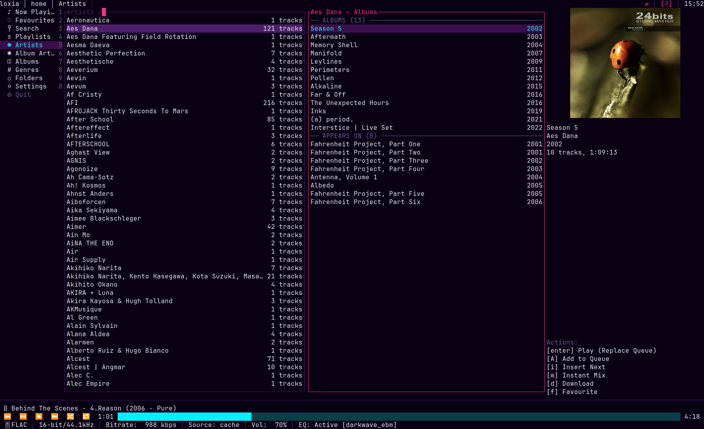
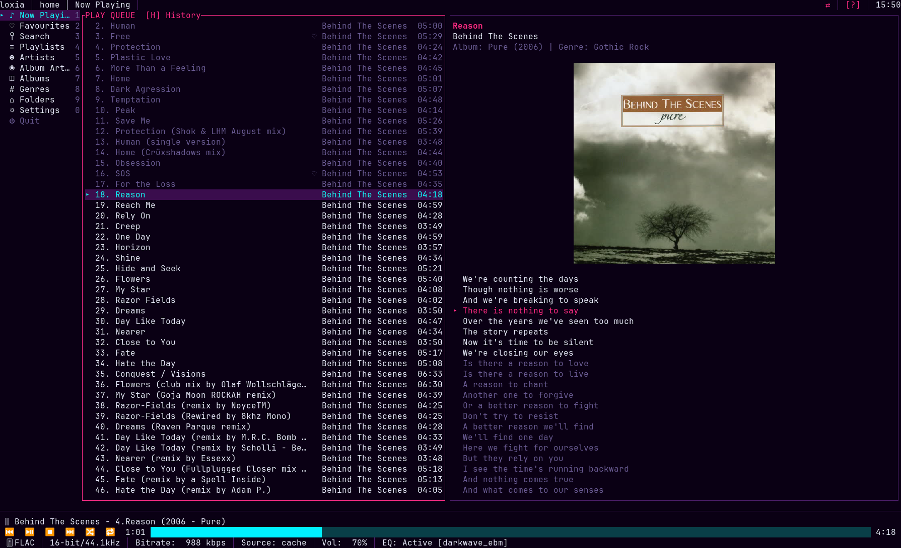
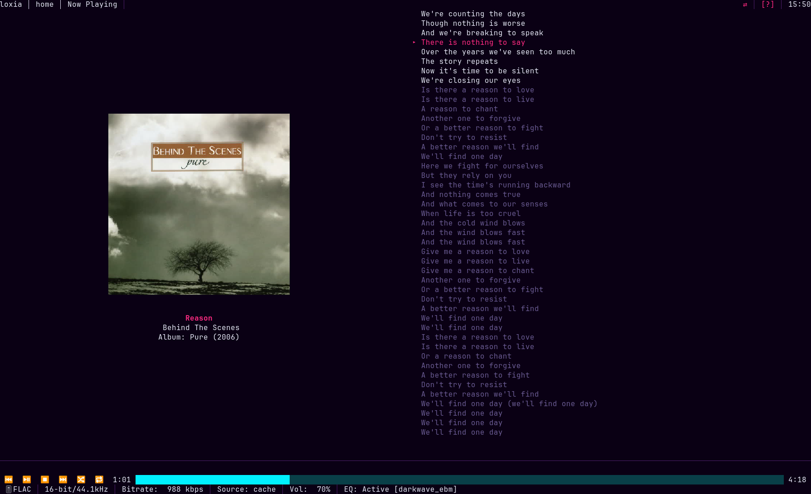

<div align="center">


# loxia

**A keyboard-driven terminal music client for [Emby](https://emby.media/).**

Miller-column browsing, gapless FLAC playback through libmpv, a 10-band equalizer,
and an offline cache that keeps working when the server does not.

[](https://github.com/tuturu742/loxia-player/actions/workflows/ci.yml)
[](LICENSE)

</div>

---

> **Status: 0.1.0 release candidate.** Every feature below is implemented and in daily use.
> The only supported installation route right now is **building from source** — package-manager
> and installer distribution is the next milestone. See [ROADMAP.md](ROADMAP.md).

## What it looks like



Drilling right pushes a new column; past three columns the older ones slide off to the left behind a
`…/parent/` breadcrumb. The rightmost pane is always a metadata inspector for whatever is highlighted,
with an action legend rendered from your live keymap.



Now Playing pairs the queue with artwork and synced `.lrc` lyrics that scroll and highlight in time.



Zen mode (`z`) drops everything but the artwork, the track, and the words.

## Features

**Browsing**
- Miller columns with a sliding three-column window across Artists, Album Artists, Albums, Genres and Folders
- **ALBUMS / APPEARS ON** split for an artist's own releases versus their guest appearances, with
  two distinct queue semantics (`Enter` replaces the queue and plays, filtered to that artist;
  `Shift+Enter` appends the whole record)
- Ten sidebar tabs, each reachable directly with `Alt+1`…`Alt+0` (`F2`…`F10` alias tabs 2–10, for
  terminals and multiplexers that swallow `Alt`)
- Fuzzy inline filter (`/`), library-wide search, favourites, playlists with in-place editing
- Visual multi-select (`v`) for bulk queueing, playlist assignment or downloading

**Playback**
- Gapless FLAC streaming through libmpv, with preloading of the next queue entry
- Quality profiles cycled live (`q`): Direct (untouched FLAC) or server-side transcode at 320 k / 192 k / 96 k in MP3, AAC or Opus
- 10-band ISO equalizer (`e`) with eight factory presets plus your own, applied without restarting playback
- ReplayGain in album, track or off modes (`r`), with a configurable preamp
- Output device picker (`O`), grouped by driver — see the note on mid-track switching in [ROADMAP.md](ROADMAP.md)
- Sleep timer (`T`) with a fade-out, by duration, end of track, or end of queue
- Non-destructive shuffle (`s`) that leaves the original order recoverable, multi-criteria sort profiles (`o`)

**Offline**
- Rolling LRU cache of what you play, with a size limit you set
- Permanent pinned downloads (`d`) of a track, album, artist or playlist
- Automatic offline mode when the server goes away: downloaded tracks keep playing, and every
  server-dependent action refuses clearly rather than hanging
- Automatic reconnect on a backoff, including onto a profile's fallback addresses

**Integration**
- Album art in Kitty, Sixel or Unicode-halfblock protocols, auto-detected
- MPRIS (Linux) and SMTC (Windows) media keys, and desktop notifications on track change
- Synced `.lrc` lyrics with a scrolling pane, plus a distraction-free Zen view (`z`)
- Mouse support: click to seek, scroll lists, click tabs and rows
- Multiple server profiles, each with fallback addresses and arbitrary custom HTTP headers for
  reverse proxies and zero-trust gateways
- Seven themes, and full in-app keybinding remapping with conflict detection

## Requirements

| | |
| :-- | :-- |
| **Emby server** | Developed and tested against Emby 4.9.5. Earlier 4.x servers are likely to work but are untested. |
| **libmpv** | 0.35 or newer (the libmpv 2.0 client API). See [Installing mpv](#installing-mpv). |
| **Rust** | 1.97.1, pinned in `rust-toolchain.toml` — `rustup` picks it up automatically. |
| **Terminal** | 80×24 minimum; true colour and a Nerd-Font-free Unicode set recommended. Kitty or a Sixel-capable terminal for artwork. |
| **OS** | Linux, macOS and Windows. Linux is the primary development platform. |

Optional: `libnotify`/`notify-osd` on Linux for desktop notifications, and a D-Bus session for MPRIS
media keys. Both degrade quietly when absent.

## Installation

Building from source is the only supported route for 0.1.0.

```sh
git clone https://github.com/tuturu742/loxia-player.git
cd loxia-player
cargo build --release
./target/release/loxia-player
```

To install the binary onto your `PATH`:

```sh
cargo install --path crates/loxia-player
```

Full per-platform instructions, including the build dependencies each distribution needs, are in
**[docs/user/installation.md](docs/user/installation.md)**.

Homebrew, the AUR, Scoop, WinGet, an `.msi` and a `.dmg` are all planned but not yet available —
see [ROADMAP.md](ROADMAP.md).

### Installing mpv

loxia links dynamically against **libmpv** and will not start without it. Install the `mpv` package
for your system; on most platforms it brings libmpv with it.

| Platform | Command |
| :-- | :-- |
| Arch, Manjaro, CachyOS | `sudo pacman -S mpv` |
| Debian, Ubuntu, Mint | `sudo apt install libmpv-dev mpv` |
| Fedora, RHEL | `sudo dnf install mpv-libs-devel mpv` |
| openSUSE | `sudo zypper install mpv-devel mpv` |
| Alpine | `sudo apk add mpv-dev mpv` |
| Void | `sudo xbps-install mpv-devel mpv` |
| macOS (Homebrew) | `brew install mpv` |
| macOS (MacPorts) | `sudo port install mpv` |
| Windows | Install [mpv](https://mpv.io/installation/) and put `mpv-1.dll` beside `loxia-player.exe` or on `PATH` |

Most distributions split the library into a `-dev`/`-devel` package that carries the headers and
the `.pc` file the build needs; the table above installs both halves where that applies.

Verify what loxia actually found:

```sh
loxia-player --doctor
```

The `Audio` section prints the libmpv version and the exact path it loaded. If it reports
`FAIL  libmpv  not found`, see [Troubleshooting](docs/user/troubleshooting.md#libmpv-is-not-found).

You can browse a library with no libmpv at all by passing `--no-audio`, which substitutes a silent
mock engine. Nothing plays, but everything else works.

## First run

```sh
loxia-player
```

The first launch writes a commented config file — `~/.config/loxia-player/config.toml` on Linux —
and starts with no server configured. Add one from inside the app:

1. Press `Alt+0` (or `F10`) for **Settings**, then select **Servers**.
2. Choose **Add server**, and fill in the protocol, host, port, username and password.
3. Press **Test connection**, then **Save**. loxia exchanges your password for an access token; the
   password itself is never written to disk.
4. Press `Alt+5` to browse Artists.

Press `?` at any time for the context-aware key cheat sheet.

The walkthrough — browsing, the two queueing modes, downloads, the equalizer, offline behaviour —
is in **[docs/user/getting-started.md](docs/user/getting-started.md)**.

## Essential keys

| Key | Action | | Key | Action |
| :-- | :-- | :-- | :-- | :-- |
| `h` `j` `k` `l` / arrows | Navigate columns and rows | | `Space` | Play / pause |
| `Enter` | Play now — replaces the queue | | `n` / `p` | Next / previous track |
| `Shift+Enter` | Append to the queue, in full | | `[` / `]` | Seek back / forward 5 s (`{` `}` = 30 s) |
| `Tab` / `Shift+Tab` | Cycle sidebar tabs | | `s` / `R` | Shuffle / cycle repeat |
| `Alt+1`…`Alt+0` | Jump straight to a tab | | `e` / `r` / `q` | Equalizer / ReplayGain / quality |
| `/` | Filter the active column | | `d` / `f` | Download / favourite |
| `v` then `.` | Visual select, toggle a row | | `z` / `?` | Zen mode / help |
| `Ctrl+Q` | Quit | | `O` / `T` | Output device / sleep timer |

Every binding is remappable, in Settings or in `config.toml`. The complete table is in
**[docs/user/keybindings.md](docs/user/keybindings.md)**.

## Configuration

One TOML file, fully documented in **[docs/user/configuration.md](docs/user/configuration.md)**.
Everything in it is also editable from Settings inside the app.

| Platform | Location |
| :-- | :-- |
| Linux, BSD | `~/.config/loxia-player/config.toml` |
| macOS | `~/Library/Application Support/loxia-player/config.toml` |
| Windows | `%APPDATA%\loxia-player\config.toml` |

The file contains a plaintext Emby access token. On Unix loxia creates it `0600` and warns at
startup if something has widened that.

## Command line

```
loxia-player [OPTIONS]

  --config <PATH>       Use this config file instead of the default location
  --server <ID>         Override the active server profile for this run
  --log-level <LEVEL>   Override logging.level; also settable via LOXIA_LOG
  --no-audio            Use the silent mock backend instead of libmpv
  --doctor              Print a diagnostics report and exit
  -h, --help            Print help
  -V, --version         Print version
```

`--doctor` is the first thing to attach to a bug report: it prints the config path and any
validation warnings, keybinding conflicts, the libmpv version and load path, every detected output
device, the terminal's graphics protocol, cache and download sizes, and server reachability — with
tokens and header values redacted. It exits non-zero if any check fails.

## Documentation

**For users**

| Document | |
| :-- | :-- |
| [Installation](docs/user/installation.md) | Building from source on each platform, and mpv |
| [Getting started](docs/user/getting-started.md) | First run, browsing, queueing, offline use |
| [Configuration](docs/user/configuration.md) | Every `config.toml` key, its default and its effect |
| [Keybindings](docs/user/keybindings.md) | The full default keymap, and how to remap it |
| [Troubleshooting](docs/user/troubleshooting.md) | Symptoms, causes, and what `--doctor` tells you |

**For contributors** — [docs/README.md](docs/README.md) indexes the architecture reference:
crate boundaries and threading model, the domain model, the Emby endpoint contract, the state
machine, the audio engine, the cache, the UI spec, the decision record and the locked dependency set.

## Contributing

See [CONTRIBUTING.md](CONTRIBUTING.md). In short: `just check-all` must be clean before a PR, which
runs `cargo fmt --check`, `cargo clippy -D warnings`, the test suite and `cargo deny check`.

## Licence

**GPL-3.0-or-later.** The full text is in [LICENSE](LICENSE).

loxia links dynamically against libmpv, which is licensed **LGPL-2.1-or-later** and is copyright the
mpv project contributors. libmpv's source is at <https://github.com/mpv-player/mpv>. The library is
never statically linked, so it remains independently replaceable. Full attribution is in
[THIRD_PARTY_LICENSES.md](THIRD_PARTY_LICENSES.md), which is also readable in-app at
**Settings → About**.

*loxia* is named for the crossbills — finches whose mandibles cross at the tip, which is also a `><`
terminal glyph. It is a sibling of `pyrrhula` in the Fringillidae suite. Branding details are in
[assets/BRANDING.md](assets/BRANDING.md).
