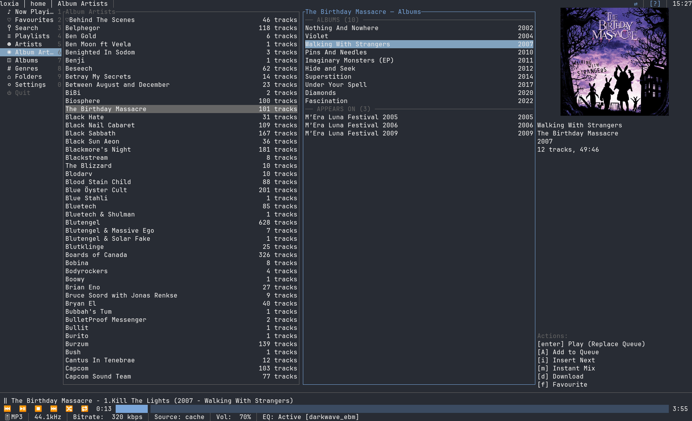
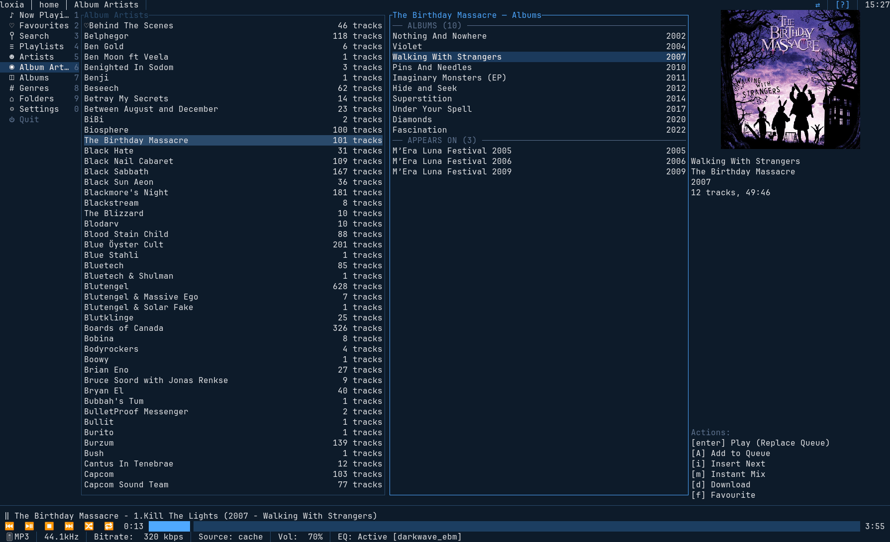
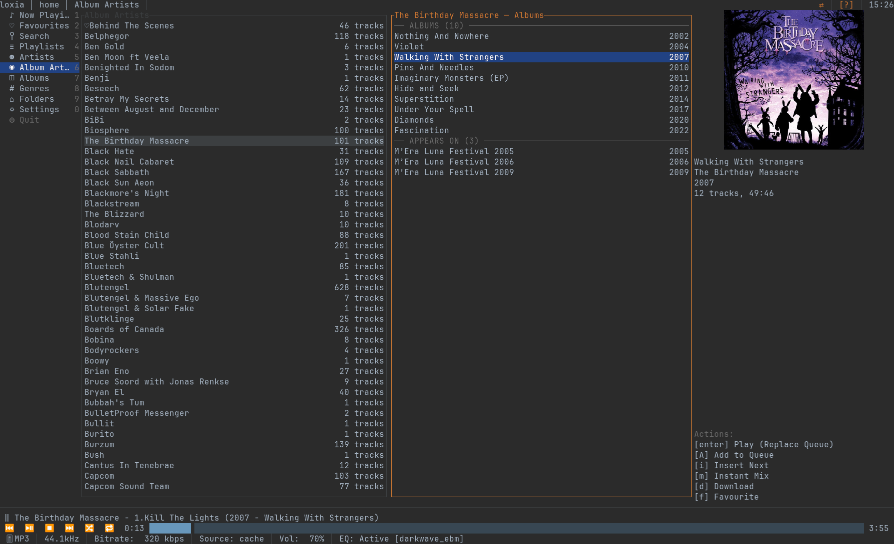
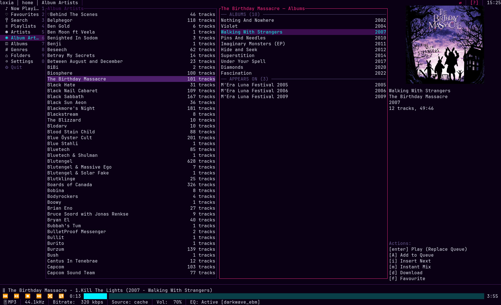
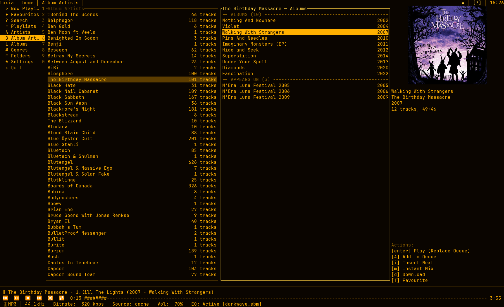
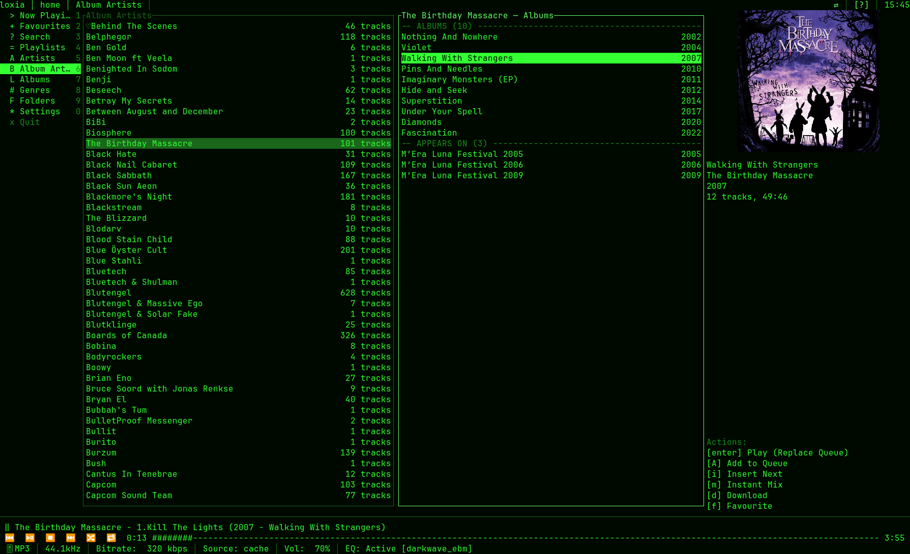
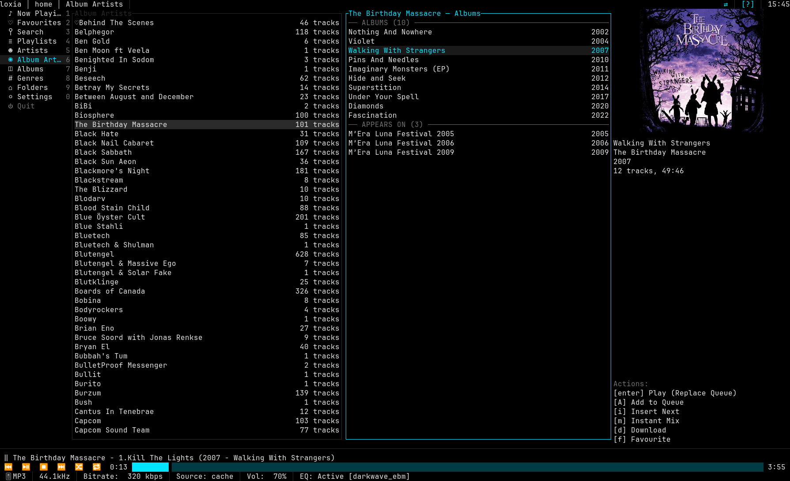

# Configuration

Everything loxia knows lives in one TOML file. Every setting in it is also editable from **Settings**
inside the app (`Alt+0`), and the app writes the file back when you change something there — so
hand-editing is optional, not required.

| Platform | Location |
| :-- | :-- |
| Linux, BSD | `~/.config/loxia-player/config.toml` |
| macOS | `~/Library/Application Support/loxia-player/config.toml` |
| Windows | `%APPDATA%\loxia-player\config.toml` |

Override the location for one run with `--config <PATH>`. `loxia-player --doctor` always prints the
path actually in use.

**Contents**

- [How the file is read](#how-the-file-is-read)
- [`schema_version`](#schema_version)
- [`[[servers]]`](#servers)
- [`[audio]`](#audio)
- [`[cache]`](#cache)
- [`[transcode]`](#transcode)
- [`[ui]`](#ui)
- [`[logging]`](#logging)
- [`[sorting]`](#sorting)
- [`[equalizer]`](#equalizer)
- [`[keybindings]`](#keybindings)
- [A complete example](#a-complete-example)

## How the file is read

- **Every key is optional.** A missing key, a missing section, or a completely empty file all yield
  the documented defaults. You only need to write down what you want to change.
- **A bad value is corrected, never fatal.** Out-of-range numbers are clamped, unknown enum values
  fall back to the default, and each correction produces a startup warning — shown as a toast, listed
  in Settings, logged, and printed by `--doctor`. loxia never refuses to start over its config.
- **A file that does not parse at all is quarantined.** It is renamed to `config.toml.bad` and
  replaced with defaults, so nothing is lost and the app still starts. The warning names the path.
- **It contains a secret.** `servers[].access_token` is a plaintext Emby token. On Unix loxia creates
  the file `0600` and warns at startup if the permissions have been widened. There is no OS-keyring
  backend in 0.1.0.
- **The app owns the file.** Changing a setting in Settings rewrites it atomically. Your comments and
  key ordering are not preserved across such a write.

## `schema_version`

```toml
schema_version = 1
```

The config format's own version. Stamped automatically; you never need to set it. If a future release
changes the format incompatibly it bumps this number and migrates your file in place on first launch.
A file from a *newer* loxia than the one reading it produces a warning and is read as best it can be,
rather than being rejected.

## `[[servers]]`

An array of server profiles. Each is one address into one Emby server, with its own credentials.

```toml
active_server = "home"

[[servers]]
id           = "home"
name         = "Living room Emby"
url          = "https://emby.example.com"
user_id      = "8f3a1c2e4d5b6a7c8d9e0f1a2b3c4d5e"
access_token = "…"
device_id    = "…"

[servers.custom_headers]
"CF-Access-Client-Id"     = "…"
"CF-Access-Client-Secret" = "…"

[[servers.fallbacks]]
url = "http://192.168.1.10:8096"
```

| Key | Default | Meaning |
| :-- | :-- | :-- |
| `active_server` | `""` | The `id` of the profile to use. Top-level, not inside `[[servers]]`. If it names nothing and exactly one profile exists, that one is used. |
| `id` | `""` | A short name you choose. Must be unique; duplicates are dropped with a warning, keeping the first. Referenced by `active_server` and `--server`. |
| `name` | `""` | Display name shown in the UI. Free text. |
| `url` | `""` | Base URL, including scheme and port. Must start with `http://` or `https://`. Do not append `/emby` — loxia adds the API path itself. A sub-path prefix (`https://host/media`) is fine and is preserved. |
| `user_id` | `""` | Your Emby user GUID. Filled in for you when you log in through Settings. |
| `access_token` | `""` | The Emby access token. Obtained by logging in through Settings; your password is never stored. |
| `device_id` | *generated* | A stable per-profile UUID for Emby session identity. Generated on first use and persisted. Do not copy it between profiles — the server would see them as one device. |
| `server_id` | *learned* | The Emby installation's own GUID, learned on the first successful connection and written back. Do not set it by hand. |

### `[servers.custom_headers]`

Arbitrary HTTP headers added to every REST request and to the WebSocket connection. This is how you
get through a reverse proxy, a Cloudflare Access gateway, or any other front door that wants a header.

Header *names* are case-insensitive. Four are set by loxia and cannot be overridden —
`Authorization`, `X-Emby-Authorization`, `Host` and `Content-Length`. Setting one of those removes it
with a warning rather than breaking authentication.

### `[[servers.fallbacks]]`

Further addresses for the **same** server, tried in order when the primary `url` cannot be reached.
The canonical use is a LAN address at home and an external one when away.

```toml
[[servers.fallbacks]]
url = "http://192.168.1.10:8096"

[[servers.fallbacks]]
url = "https://emby.example.com"

[servers.fallbacks.custom_headers]
"CF-Access-Client-Id" = "…"
```

Each entry takes a `url` and optionally its own `custom_headers` — useful when the external path needs
a gateway token the LAN one does not. Everything else (account, token, device id) comes from the
profile.

Before an address is used it must prove it is the same installation, by matching the profile's learned
`server_id`. An address that answers as a *different* server is skipped, loudly — so a stale DNS entry
or a config copied to another machine can never attach your cache and downloads to someone else's
library.

Because storage is keyed on the server's identity rather than on the address, all of a profile's
addresses share one cache, one download tree and one session. That is the whole reason fallbacks exist
as a list inside a profile instead of as separate profiles.

## `[audio]`

```toml
[audio]
output_driver         = "auto"
device_id             = "auto"
default_replaygain    = "album"
replaygain_preamp_db  = 0.0
buffer_size_ms        = 2000
```

| Key | Default | Meaning |
| :-- | :-- | :-- |
| `output_driver` | `"auto"` | mpv audio output driver — `auto` lets mpv choose. Which names are valid depends on how your mpv was built; common ones are `alsa`, `pipewire`, `pulse`, `jack`, `sndio`, `wasapi` and `coreaudio`. `--doctor` lists what yours actually offers. |
| `device_id` | `"auto"` | A specific output device, in mpv's `driver/device` form (`alsa/hw:0,0`, `pipewire/alsa_output…`). Easiest set with `O` in the app, which writes it here. |
| `default_replaygain` | `"album"` | `album`, `track` or `off`. Album mode preserves an album's internal dynamics; track mode levels every track independently. |
| `replaygain_preamp_db` | `0.0` | Gain applied on top of ReplayGain, in dB. Negative values give headroom against clipping on loud masters. |
| `buffer_size_ms` | `2000` | How far ahead mpv reads the stream, in milliseconds (its `cache-secs` option). Raise it on a flaky or high-latency connection. |

`loxia-player --doctor` lists every device mpv can see, with the exact id to paste into `device_id`.

## `[cache]`

Two independent tiers. The **rolling cache** fills itself as you listen and evicts the least recently
used files when it hits its limit. **Downloads** are pinned by you with `d` and are never evicted.

```toml
[cache]
enabled          = true
rolling_max_gb   = 5.0
image_cache_mb   = 200
prefetch_on_play = false
prefetch_next    = 1
cache_dir        = "auto"
download_dir     = "auto"
```

| Key | Default | Meaning |
| :-- | :-- | :-- |
| `enabled` | `true` | Master switch for the rolling cache. `false` streams everything every time; pinned downloads still work. |
| `rolling_max_gb` | `5.0` | Size limit for the rolling track cache, in GiB. Must be positive; a zero or negative value is reset to `5.0` with a warning. Pinned downloads do not count against it. |
| `image_cache_mb` | `200` | Size limit for cached artwork, in MiB. |
| `prefetch_on_play` | `false` | Also cache the track that is *currently playing*, alongside streaming it. Off by default because it costs double bandwidth on a first play and only pays off on a later replay or offline. |
| `prefetch_next` | `1` | How many *upcoming* queue entries to pull into the cache ahead of time, so a skip forward or a dropped connection finds them local. `0` disables it; the maximum is `10`, and a larger value is clamped with a warning. Ignored when `enabled = false`. |
| `cache_dir` | `"auto"` | `"auto"` uses the platform cache directory. Otherwise an **absolute** path — a relative one is rejected with a warning and the default is used, rather than scattering caches wherever you happened to launch from. |
| `download_dir` | `"auto"` | Same rules, for pinned downloads. Point it at a large disk if you download a lot. |

Both directories are namespaced internally by the server's identity, so two profiles pointing at one
server share their contents instead of keeping two copies.

## `[transcode]`

```toml
[transcode]
mode                   = "direct"
target_codec           = "mp3"
download_uncompressed  = true
```

| Key | Default | Meaning |
| :-- | :-- | :-- |
| `mode` | `"direct"` | The active quality profile: `direct` (untouched source, usually FLAC), `transcode_high` (320 kbps), `transcode_med` (192 kbps), `transcode_low` (96 kbps). Cycled live with `q`, which writes the new value here. |
| `target_codec` | `"mp3"` | Which codec the server transcodes to when `mode` is not `direct`: `mp3`, `aac` or `opus`. Ignored in `direct`. Opus is the best quality per bit at 96 k; MP3 is the most universally supported. |
| `download_uncompressed` | `true` | Pinned downloads always fetch the original file regardless of `mode`. Set `false` to have downloads honour the active quality profile instead — smaller files, for a device short on space. |

## `[ui]`

```toml
[ui]
theme                 = "default_terminal"
album_art_protocol    = "auto"
desktop_notifications = true
enable_mouse          = true
enable_websocket      = true
restore_session       = true
restore_autoplay      = false
ascii_only            = false
show_lyrics           = true
show_inspector_art    = true
now_playing_format    = "{title} — {artist} ({album})"
```

| Key | Default | Meaning |
| :-- | :-- | :-- |
| `theme` | `"default_terminal"` | One of the seven below. An unknown name falls back to `default_terminal` with a warning. |
| `album_art_protocol` | `"auto"` | `auto` queries the terminal and picks the best it supports. Force one with `kitty`, `sixel` or `halfblocks`, or turn artwork off entirely with `off` — which skips the fetch, not just the drawing. |
| `desktop_notifications` | `true` | Native OS notification on track change. **Suppressed while the terminal has focus** — you can already see the change. Needs libnotify on Linux; silently does nothing if absent. |
| `enable_mouse` | `true` | Scroll, click-to-focus, click-to-seek. Turn off if you would rather your terminal's own text selection stayed available. |
| `enable_websocket` | `true` | Emby's WebSocket channel, for remote control and live library updates. Turn off behind a proxy that does not pass WebSocket upgrades. |
| `restore_session` | `true` | Restore the queue, playback position, active tab, volume, quality profile and EQ on launch. |
| `restore_autoplay` | `false` | Whether a restored session starts playing. Off by default: a restored session resumes **paused**, showing where it stopped, so starting loxia from a shell for an unrelated reason does not seize the audio device. |
| `ascii_only` | `false` | Replace box-drawing and block glyphs with ASCII, for terminals or fonts with poor Unicode coverage. The `amber_crt` and `green_crt` themes set this themselves. |
| `show_lyrics` | `true` | Whether the lyrics pane is visible. Toggled live with `L`. |
| `show_inspector_art` | `true` | Whether the inspector draws artwork above the metadata. `false` skips the fetch entirely and gives those rows back to the metadata. |
| `now_playing_format` | `"{title} — {artist} ({album})"` | The player bar's "what's playing" line. Placeholders: `{title}` `{artist}` `{album}` `{album_artist}` `{year}` `{track_number}` `{disc_number}` `{genre}` `{duration}`. An unknown placeholder is left verbatim so a typo is visible rather than silently blanking the line. |

### Themes

Seven are built in. `default_terminal` is the odd one out: it uses your terminal's own ANSI palette and
leaves the background transparent, so it inherits whatever colour scheme you already run.

<details>
<summary><b>default_terminal</b> — your terminal's own palette, transparent background</summary>


</details>

<details>
<summary><b>far_blue</b> — the blue of an older file manager</summary>


</details>

<details>
<summary><b>darcula</b> — dark IDE greys and orange</summary>


</details>

<details>
<summary><b>cyberpunk_neon</b> — magenta and cyan, matching the project's own mark</summary>


</details>

<details>
<summary><b>amber_crt</b> — monochrome amber; sets <code>ascii_only</code> itself</summary>


</details>

<details>
<summary><b>green_crt</b> — monochrome green; sets <code>ascii_only</code> itself</summary>


</details>

<details>
<summary><b>oled_black</b> — pure black, for panels that switch pixels off</summary>


</details>

## `[logging]`

```toml
[logging]
level     = "info"
max_files = 5
```

| Key | Default | Meaning |
| :-- | :-- | :-- |
| `level` | `"info"` | Exactly one of `trace`, `debug`, `info`, `warn` or `error`. Anything else falls back to `info` with a warning. |
| `max_files` | `5` | How many daily-rotated log files to keep. Older ones are pruned at startup. |

Logs go to a file, never to the terminal — the terminal belongs to the UI. They land in the state
directory: `~/.local/state/loxia-player/` on Linux, alongside the downloads on macOS and Windows.
`--doctor` prints the directory and names the newest file.

Precedence for the level is `--log-level` over the `LOXIA_LOG` environment variable over this key.
Those two are passed straight to the log filter and are **not** restricted to a plain level name, so
per-module `tracing` directives work there even though they do not in the config file:

```sh
LOXIA_LOG='info,loxia_emby=debug' loxia-player
```

Tokens and stream URLs are redacted from every log line.

## `[sorting]`

Named, reusable sort profiles. Each stacks up to **four** rules, applied in order; a profile with more
is truncated with a warning.

```toml
[sorting]
default_queue_profile = "chronological_discog"

[[sorting.profiles]]
name  = "chronological_discog"
rules = [
  { field = "album_artist", direction = "asc" },
  { field = "year",         direction = "asc" },
  { field = "album",        direction = "asc" },
  { field = "track_number", direction = "asc" },
]

[[sorting.profiles]]
name  = "release_chronology"
rules = [
  { field = "year",         direction = "desc" },
  { field = "album",        direction = "asc" },
  { field = "track_number", direction = "asc" },
]
```

| Key | Default | Meaning |
| :-- | :-- | :-- |
| `default_queue_profile` | `"chronological_discog"` | Which profile new queues use. A name matching no profile is reset to the first one with a warning. |
| `profiles[].name` | — | Your name for the profile. Shown in the `o` menu. |
| `profiles[].rules[].field` | — | `name`, `artist`, `album_artist`, `album`, `year`, `track_number`, `genre` or `date_added`. |
| `profiles[].rules[].direction` | — | `asc` or `desc`. |

The two profiles above are the built-in defaults. Writing your own `[[sorting.profiles]]` entries
replaces the whole list, so include any of the defaults you still want. Settings → Sorting has an
editor for all of this.

## `[equalizer]`

A 10-band graphic equalizer on the ISO centre frequencies **31, 63, 125, 250, 500, 1 000, 2 000,
4 000, 8 000 and 16 000 Hz**.

```toml
[equalizer]
enabled       = false
active_preset = "flat"

[[equalizer.custom_presets]]
name  = "late night"
gains = [2.0, 1.5, 0.5, -1.0, -1.5, -0.5, 0.0, 1.0, 1.5, 1.0]
```

| Key | Default | Meaning |
| :-- | :-- | :-- |
| `enabled` | `false` | Master switch. Toggled live from the `e` modal. |
| `active_preset` | `"flat"` | The preset in use, factory or custom. |
| `custom_presets[].name` | — | Your name for it. A name colliding with a factory preset is renamed to `"<name> (custom)"` with a warning. |
| `custom_presets[].gains` | — | Exactly ten gains in dB, one per band in the order above. Clamped to ±12 dB, with a warning if anything was out of range. |

The eight factory presets are `flat`, `darkwave_ebm`, `bass_boost`, `vocal`, `acoustic`,
`night_listening_warm`, `loudness` and `classical`. They are built into the binary and cannot be
edited; save a modified curve under a new name instead, which the `e` modal does for you.

## `[keybindings]`

A table of `action_name = "chord"`. Full syntax, the complete list of action names, and the defaults
are in **[Keybindings](keybindings.md)**.

```toml
[keybindings]
seek_back5      = "ctrl+left"
seek_forward5   = "ctrl+right"
delete_playlist = "none"        # unbind entirely
```

An override *replaces* that action's default bindings rather than adding to them. Unparseable chords
are skipped with a warning; conflicts are reported but never fatal.

## A complete example

Everything below is optional — this is a config that changes a fair amount from the defaults, not a
file you need to reproduce.

```toml
schema_version = 1
active_server  = "home"

[[servers]]
id      = "home"
name    = "Living room Emby"
url     = "https://emby.example.com"
user_id = "8f3a1c2e4d5b6a7c8d9e0f1a2b3c4d5e"
# access_token and device_id are filled in by Settings > Servers

[servers.custom_headers]
"CF-Access-Client-Id"     = "…"
"CF-Access-Client-Secret" = "…"

[[servers.fallbacks]]
url = "http://192.168.1.10:8096"

[audio]
output_driver        = "pipewire"
default_replaygain   = "album"
replaygain_preamp_db = -1.5

[cache]
rolling_max_gb = 20.0
prefetch_next  = 2
download_dir   = "/mnt/media/loxia-downloads"

[transcode]
mode         = "direct"
target_codec = "opus"

[ui]
theme              = "cyberpunk_neon"
restore_autoplay   = true
now_playing_format = "{artist} — {title}"

[logging]
level     = "info"
max_files = 10

[equalizer]
enabled       = true
active_preset = "darkwave_ebm"

[keybindings]
seek_back5    = "ctrl+left"
seek_forward5 = "ctrl+right"
```

## See also

- [Keybindings](keybindings.md) — the full keymap and remapping rules
- [Getting started](getting-started.md) — what these settings actually change in use
- [Troubleshooting](troubleshooting.md) — when a setting does not appear to take effect
