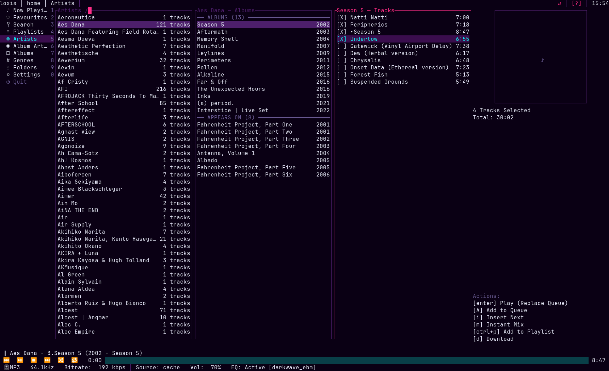
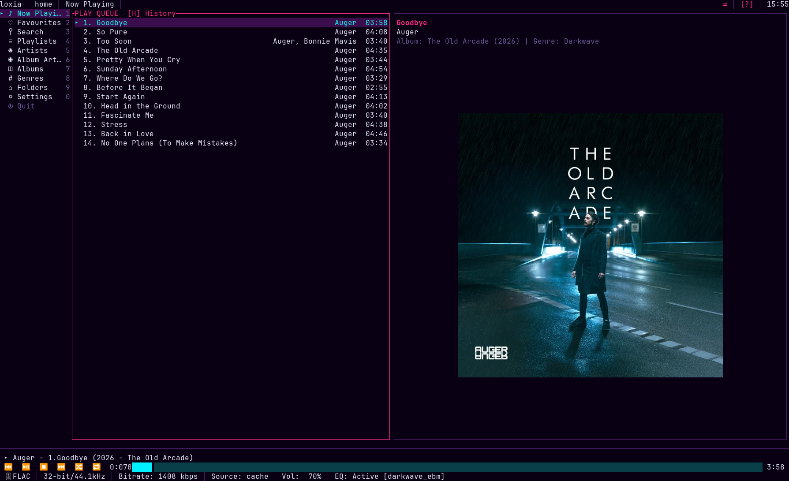
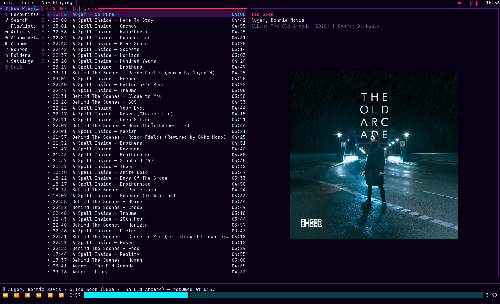
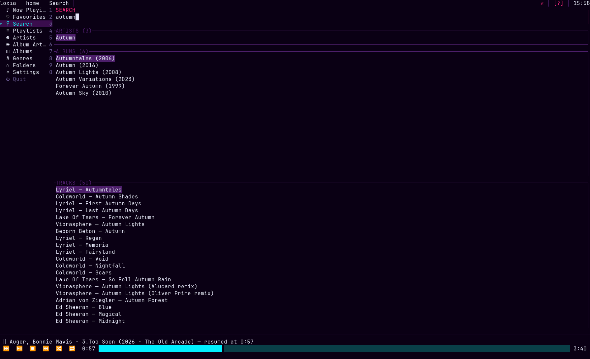
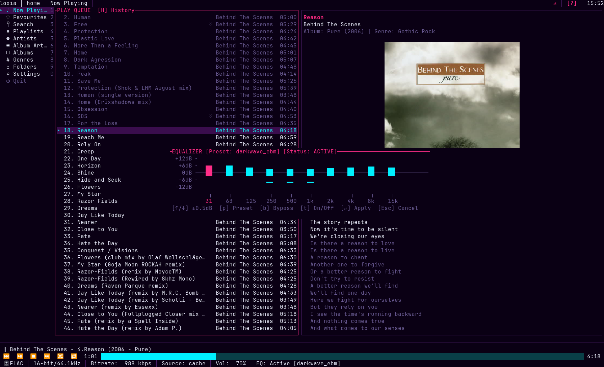
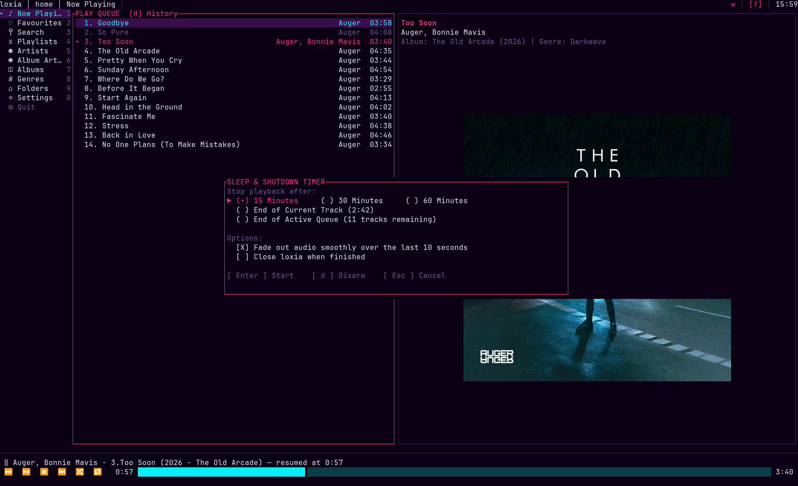
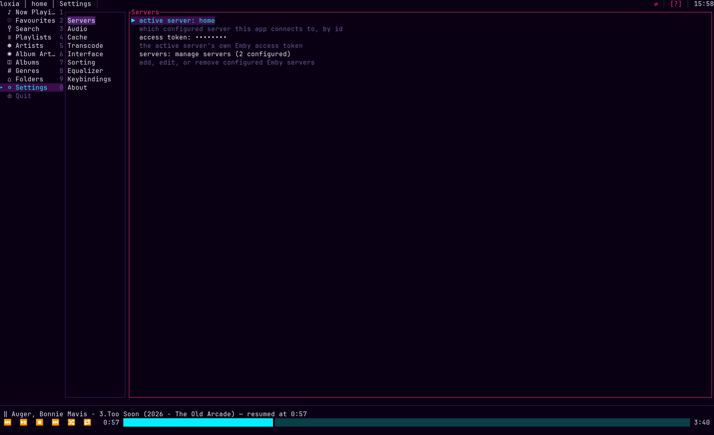

# Getting started

A walkthrough of loxia from the first launch through the parts that are not obvious. Assumes you have
it [installed](installation.md) and an Emby server to point it at.

- [First launch](#first-launch)
- [Connecting to a server](#connecting-to-a-server)
- [The layout](#the-layout)
- [Browsing](#browsing)
- [ALBUMS and APPEARS ON](#albums-and-appears-on)
- [Queueing: play now versus append](#queueing-play-now-versus-append)
- [Selecting several things](#selecting-several-things)
- [The queue](#the-queue)
- [Search, favourites and playlists](#search-favourites-and-playlists)
- [Audio](#audio)
- [Lyrics and Zen mode](#lyrics-and-zen-mode)
- [Media keys and remote control](#media-keys-and-remote-control)
- [Offline listening](#offline-listening)
- [Sessions](#sessions)
- [Settings](#settings)
- [Getting unstuck](#getting-unstuck)

## First launch

```sh
loxia-player
```

The first run writes a commented `config.toml` and starts with nothing configured. You will see the
layout with empty columns and a message about no server. That is expected.

Press `?` at any point for the key cheat sheet. It is rendered from your live keymap, so it is always
correct even after you remap things.

Press `Ctrl+Q` to quit.

## Connecting to a server

Do this from inside the app rather than by hand-editing the config — logging in exchanges your
password for an access token, and the password is never written anywhere.

1. `Alt+0` (or `F10`) → **Settings**.
2. Select **Servers** → **Add server**.
3. Fill in:
   - **protocol** — `http` or `https`, cycled with `←`/`→`
   - **host** — hostname or IP, with no scheme and no path
   - **port** — Emby's default is `8096` (`8920` for HTTPS). Leave empty if your reverse proxy serves
     it on the standard port.
   - **username** and **password** — your Emby credentials
4. Select **Test connection**. It reports the server name and version on success, or exactly what went
   wrong.
5. Select **Save**.
6. `Alt+5` → **Artists**.

### Behind a proxy or a gateway

If your server sits behind something that wants a header — Cloudflare Access, an authenticating
proxy, a zero-trust gateway — add the headers in the same form, under **add header**. They are sent
with every REST request and with the WebSocket connection.

### One server, several addresses

A LAN address at home and an external one when away are two **addresses of one server**, not two
servers. Add the second as a *fallback* on the same profile: in the server editor, the `address:` row
selects between them with `←`/`→`, and **add another address** appends one. Each address keeps its own
headers and can be tested separately.

loxia tries them in order and verifies that whichever answers is really the same Emby installation
before using it. Because storage is keyed on the server's own identity rather than on the address, all
of a profile's addresses share one cache, one download tree and one saved session — you do not
re-download your music when you get home.

### Several servers

Add as many profiles as you like, and switch between them from the same editor: highlight a profile and
press `S`. loxia saves the outgoing server's session, clears the queue and history, reconnects, and
reseeds the columns — so each server keeps its own saved session, cache and downloads.

`x` removes a profile. Press `D` first to also delete that server's cached tracks, downloads and saved
session when it goes; without it the profile disappears but its data stays on disk. The **active**
profile cannot be removed — switch away first, which the editor will tell you.

The footer of the server list names all of it: `[a] add  [Enter] edit  [x] remove  [D] delete data on
remove  [S] switch  [Esc] close`.

## The layout

```text
┌──────────────────────── header: server · tab · badges · clock ─────────────────────┐
├─ sidebar ─┬────────────── centre canvas ──────────────┬──────── inspector ─────────┤
│  10 tabs  │   up to 3 Miller columns, or a view       │  metadata for the          │
│           │                                           │  highlighted row           │
├───────────┴───────────────────────────────────────────┴────────────────────────────┤
│  player bar: now playing · seek bar · codec / bitrate / output / EQ / volume        │
└────────────────────────────────────────────────────────────────────────────────────┘
```


The **header** carries badges you should learn to read: offline, active downloads, shuffle, repeat, an
armed sleep timer, and a warning count.

The **sidebar** has ten tabs. `Tab`/`Shift+Tab` cycles; `Alt+1`…`Alt+0` jumps:

| | Tab | What it is |
| :-- | :-- | :-- |
| `Alt+1` | Now Playing | The queue, plus a history sub-view (`H`) |
| `Alt+2` | Favourites | Favourited artists, albums, tracks and playlists |
| `Alt+3` | Search | Library-wide search, results split by kind |
| `Alt+4` | Playlists | Emby playlists, editable in place |
| `Alt+5` | Artists | Every performer credited on any track |
| `Alt+6` | Album Artists | Only artists credited as an *album* artist |
| `Alt+7` | Albums | All albums, flat |
| `Alt+8` | Genres | Genre → artists → albums |
| `Alt+9` | Folders | The real directory tree |
| `Alt+0` | Settings | Everything configurable, plus About |

**Artists versus Album Artists** is worth understanding on a library with many compilations: *Artists*
lists everyone who plays on anything, which can be thousands of entries; *Album Artists* lists only
the artists your library is actually organised by, and is usually much shorter.

## Browsing

`j`/`k` (or `↑`/`↓`) move; `l`/`→` drills in; `h`/`←` steps back out. `Backspace` drops the rightmost
column.

At most three data columns are visible at once, and the focused one is always the rightmost. Drilling
deeper slides the older columns off to the left behind a `…/parent/` breadcrumb, so you never lose
your sense of where you are.

Large lists page in as you scroll — with the keyboard and with the mouse wheel. The wheel over a
column you have *not* focused scrolls that column without moving focus.

`/` opens a fuzzy filter on the focused column. It keeps pulling pages while you type, so it finds
things well past the first screenful. `Esc` cancels; `Enter` commits.

`g g` / `Home` and `G` / `End` jump to the ends. `Ctrl+U` / `Ctrl+D` move half a screen. `Ctrl+R`
retries a column that failed to load.

The **inspector** on the right always describes whatever is highlighted: artwork, then metadata, then
a legend of the actions that apply — with their *current* key bindings, and clickable.

## ALBUMS and APPEARS ON

Select an artist and the albums column splits under two unselectable headers:

```text
── ALBUMS (2) ──────────────────
  Care (2019)
  Yr Body Is Nothing (2016)
── APPEARS ON (2) ──────────────
  Synthwave Comp Vol. 1 (2020)
  Adult Swim Singles (2021)
```

**ALBUMS** are releases where this artist is the album artist. **APPEARS ON** are compilations,
soundtracks and collaborations where they contribute some tracks. Drilling into an APPEARS ON album
dims the tracks by other artists and highlights the ones featuring yours.

This split is what makes the two queueing keys mean different things — see next.

## Queueing: play now versus append

Two keys, differing in two ways at once:

|  | `Enter` (or `a`) | `Shift+Enter` (or `A`) |
| :-- | :-- | :-- |
| The existing queue | **replaced** | **appended to** |
| Playback | starts immediately | carries on undisturbed |
| On an APPEARS ON album | only this artist's tracks | the whole compilation |

So `Enter` means "play this now" and `Shift+Enter` means "add this to the end". On an ordinary album
the artist filter changes nothing, but replace-versus-append still does.

Both work on any row, at any level:

- a **track** — that track
- an **album** — the album, in disc and track order
- an **artist** — all their tracks, ordered by the active sort profile with albums kept whole
- a **genre** — every track in it, same ordering, with a toast reporting the count
- a **folder** — its entire subtree, in filename order

`i` inserts the selection immediately after the playing track instead of at the end — including a whole
album or artist.

`m` starts an Emby **Instant Mix** seeded from whatever is highlighted: a radio station built from one
artist, album or track. Needs a connection.

## Selecting several things

`v` enters visual multi-select. `.` toggles the row under the cursor, `V` selects everything in the
column, `Esc` clears. The inspector shows the count and total duration.



Then any of `Enter`, `Shift+Enter`, `i`, `Ctrl+P` or `d` applies to the whole selection, in the order
the rows are displayed.

A selection holds **one kind of row at a time**. With folders selected, `.` on a track is refused with
a toast — which keeps "queue all of this" from meaning something ambiguous.

Toggling is `.` and not `Space`, because `Space` is unconditionally play/pause everywhere.

## The queue

`Alt+1` shows it. `j`/`k` move a cursor through it; the pane follows the playing track until you
scroll manually. A single click moves the cursor, a double-click jumps playback to that entry, and the
wheel scrolls.



| Key | |
| :-- | :-- |
| `x` | Remove the entry under the cursor. Removing the playing one advances playback. |
| `s` | Shuffle, and shuffle again to unshuffle. **Non-destructive**: the original order is kept intact and comes back exactly, with the current track still playing. |
| `R` | Cycle repeat off → all → one |
| `o` | Sort menu. Its first row is **Default order (as queued)**, which restores the order things were added in and clears the profile. |
| `P` | Save the queue (or the selection) as a new Emby playlist |
| `H` | Swap the queue pane for **listening history** — recently played tracks with timestamps. `Enter` on a row re-queues that track. |



Sort profiles stack up to four rules. The default, `chronological_discog`, sorts album artist → year →
album → track number, which is what you want for "play this artist's discography in order". Queueing an
individual album always plays it in disc/track order regardless of the profile.

## Search, favourites and playlists

**Search** (`Alt+3`): type in the query line; results arrive after a short debounce, grouped into
Artists, Albums and Tracks with counts. `↓` moves from the query into the results, `Tab` cycles
between groups. `Enter` on an artist or album drills into it; `←` comes back.



**Favourites** (`Alt+2`): `f` toggles favourite on a track, album, artist or playlist, anywhere —
including in Now Playing and in Zen mode. Favourited items appear here in sections, and everything you
can do elsewhere works here too.

**Playlists** (`Alt+4`): drill in to see the tracks. `Ctrl+↑`/`Ctrl+↓` reorder a track, `x` removes
one, `Ctrl+P` adds the current selection to an existing playlist, `P` saves the queue as a new one, and
`X` deletes a playlist after a confirmation. All of it round-trips to the server.

## Audio

### Quality

`q` cycles Direct → 320 k → 192 k → 96 k. **Direct** streams the source file untouched — FLAC stays
FLAC. The other three ask the server to transcode, to the codec set by `transcode.target_codec`
(`mp3`, `aac` or `opus`). Useful on a metered or slow connection. The change takes effect on the next
track load.

### Equalizer

`e` opens the 10-band equalizer on the ISO frequencies 31 Hz to 16 kHz. Adjusting a band is audible
immediately, with no playback restart.

| Key | |
| :-- | :-- |
| `Enter` | Keep the edit and close |
| `Esc` | Discard and close |
| `t` | Turn the equalizer off entirely |
| `b` | Bypass — hear it flat without losing your curve |



Eight factory presets ship with it: `flat`, `darkwave_ebm`, `bass_boost`, `vocal`, `acoustic`,
`night_listening_warm`, `loudness`, `classical`. Factory presets are read-only; a modified curve saves
under a new name.

### ReplayGain

`r` cycles album → track → off. **Album** mode applies one gain per album, preserving the loudness
relationships the mastering engineer intended. **Track** mode levels every track independently, which
is what you want on a shuffled mix of singles. Add headroom against clipping with
`audio.replaygain_preamp_db`.

### Output device

`O` opens the picker, grouped by driver with the most capable first, and `--doctor` prints the same
list with the exact ids.

**Switching mid-track is unreliable in 0.1.0** — the picker lists devices correctly, but applying a
change while a track is playing does not dependably take effect. The route that works is to set the
device before playback starts, or to put it in the config:

```toml
[audio]
device_id = "pipewire/alsa_output.pci-0000_00_1f.3.analog-stereo"
```

### Sleep timer

`T` arms one. Choose a duration, end of current track, or end of queue; optionally fade out over the
last seconds. The header badge counts down. `d` disarms a running timer, and cancelling restores the
pre-fade volume.



## Lyrics and Zen mode

`L` shows and hides the lyrics pane. A track with an `.lrc` sidecar gets **synced** lyrics that scroll
and highlight in time; a track with only a plain transcript shows it as readable text; a track with
neither hides the pane rather than showing an empty box. `J`/`K` scroll manually, detaching from
auto-follow until the track changes.

`z` enters **Zen mode**: artwork, title block and lyrics, and nothing else. The player bar stays
exactly where it was, so toggling in and out does not shift the screen under you. `z` again leaves.


Artwork renders as real images in Kitty, Ghostty, WezTerm, Konsole and any Sixel-capable terminal.
Elsewhere it falls back to Unicode half-blocks, which is coarse but recognisable. Force a protocol, or
turn artwork off entirely, with `ui.album_art_protocol`.

## Media keys and remote control

**Media keys** work through MPRIS on Linux and SMTC on Windows: play/pause, next and previous from your
keyboard's dedicated keys, and loxia appears in your desktop's now-playing panel with title, artist,
album and artwork. On Linux this needs a D-Bus session; with none, there is simply nothing to register
with and the feature is quietly absent.

**Desktop notifications** fire on track change — but only when the terminal does *not* have focus,
since a change you are looking at needs no announcement. Turn them off with
`ui.desktop_notifications = false`.

**Remote control** runs over Emby's WebSocket channel: play/pause, next, previous, seek, volume and
mute sent from the Emby web UI or another Emby client are obeyed, and a library change on the server
refreshes the affected view. Turn it off with `ui.enable_websocket = false` — worth doing if a reverse
proxy in front of Emby does not pass WebSocket upgrades, since the connection will only fail and retry.

## Offline listening

Two independent mechanisms.

### The rolling cache

Fills itself as you listen and evicts the least recently used files when it hits `cache.rolling_max_gb`
(5 GiB by default). You do not manage it. `cache.prefetch_next` (1 by default) pulls that many upcoming
queue entries in ahead of time, so a skip forward or a dropped connection finds them already local.

The player bar's source field tells you whether the current track came from the cache or the network.

### Downloads

`d` **pins** something permanently — a track, an album, an artist or a whole playlist, or everything in
a visual selection. Pinned content is never evicted. A pinned row shows `↓` in the list, and `d` again
unpins it and reclaims the space. The header shows a badge while downloads are in flight.

By default downloads fetch the original file regardless of the active quality profile; set
`transcode.download_uncompressed = false` to have them honour it instead.

### When the server goes away

After a few consecutive failed requests loxia enters **offline** mode: an `OFFLINE` badge appears in
the header and a toast says "working offline". From there:

- Anything that genuinely needs the server — search, instant mix, playlist edits, favouriting — refuses
  with a toast rather than hanging.
- Downloaded tracks keep playing, with no network involved. Queue entries that were only streamable are
  marked unavailable.
- A background probe retries with a backoff. When it succeeds the badge clears, and the profile's
  fallback addresses are part of that retry — so moving from your LAN to an external connection
  reconnects on its own.

**Two current limitations,** both of subsystems that are built and tested but not yet connected to the
running app (see [ROADMAP.md](../../ROADMAP.md)):

- **Browsing while offline** is limited to the columns already loaded. Fetching a fresh column from
  your downloaded library is not wired up, so navigating somewhere new while disconnected shows a load
  failure rather than your pinned content. Playback of what is already queued and downloaded is
  unaffected.
- **Play counts reported while offline are lost, not buffered.** Anything you listen to with the server
  reachable is reported normally; anything played during a dropout is dropped with a log line rather
  than replayed on reconnect. If you rely on a server-side Last.fm plugin, offline listening will not
  show up in it.

## Sessions

Quitting saves the queue, the playing track and position, the active tab, volume, quality profile and
EQ state. Relaunching restores all of it — **paused**, showing where you stopped.

Paused on purpose: starting loxia from a shell for some unrelated reason should not seize your audio
device and start playing. Press `Space` to pick up where you left off, or set
`ui.restore_autoplay = true` to have it resume by itself.

Selecting something new on a restored session plays it immediately rather than appending to the
restored queue.

`Ctrl+C` quits as cleanly as `Ctrl+Q`. Either way the terminal is restored properly — no raw mode or
alternate screen left behind, even on a panic.

## Settings

`Alt+0`. Nine sections: **Servers**, **Audio**, **Cache**, **Transcode**, **Interface**, **Sorting**,
**Equalizer**, **Keybindings**, **About**.

Everything is editable here, everything persists, and nothing needs the config file. `Esc` from a
control returns to the section list, `Esc` again to the sidebar.



Worth a visit early:

- **Interface** → theme. Seven built in: `default_terminal` (which uses your terminal's own palette and
  keeps the background transparent), `far_blue`, `darcula`, `cyberpunk_neon`, `amber_crt`, `green_crt`,
  `oled_black`. Also `ascii_only`, for terminals with thin Unicode coverage.
- **Keybindings** → remap anything. Press the chord you want; a chord already in use names its current
  owner before you take it over.
- **About** → versions, cache and download statistics, and **copy diagnostics** — which redacts your
  token.

For the whole picture of what each setting does, see [Configuration](configuration.md).

## Getting unstuck

| | |
| :-- | :-- |
| `?` | The full key list, always current |
| `Esc` | Back out of anything — a modal, a filter, a selection, a settings control |
| `Ctrl+R` | Retry a column that failed to load |
| `Ctrl+Q` | Quit, saving the session |
| `loxia-player --doctor` | What loxia thinks about your setup, from libmpv to server reachability |

For symptoms and causes, see [Troubleshooting](troubleshooting.md).
