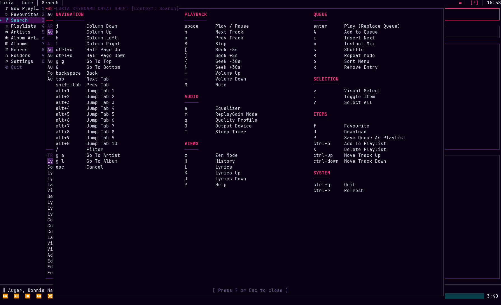

# Keybindings

Press `?` (or `F1`) inside loxia for the same table, grouped the same way, rendered live from
whatever your bindings actually are.



The default keymap is **flat**: one chord means one action in every view, with no context scoping. A
key never does one thing in the queue and something else in a column, which is why the on-screen key
hints never need a qualifier. Everything is remappable.

- [The default keymap](#the-default-keymap)
- [Remapping](#remapping)
- [Binding syntax](#binding-syntax)
- [Conflicts](#conflicts)
- [Notes on specific choices](#notes-on-specific-choices)

## The default keymap

All 67 actions are bound out of the box. Where two chords are listed, both are equal — neither is a
"real" binding the other aliases.

### Navigation

| Keys | Action | What it does |
| :-- | :-- | :-- |
| `j` `↓` | `move_down` | Next row in the focused column |
| `k` `↑` | `move_up` | Previous row |
| `h` `←` | `nav_left` | Focus the column to the left |
| `l` `→` | `nav_right` | Drill into the highlighted row, pushing a new column |
| `Ctrl+D` `PageDown` | `half_page_down` | Down half a screen |
| `Ctrl+U` `PageUp` | `half_page_up` | Up half a screen |
| `g g` `Home` | `go_to_top` | First row |
| `G` `End` | `go_to_bottom` | Last row |
| `Backspace` | `pop_column` | Drop the rightmost column |
| `Tab` | `next_tab` | Next sidebar tab |
| `Shift+Tab` | `prev_tab` | Previous sidebar tab |
| `Alt+1` | `jump_tab1` | Now Playing |
| `Alt+2` `F2` | `jump_tab2` | Favourites |
| `Alt+3` `F3` | `jump_tab3` | Search |
| `Alt+4` `F4` | `jump_tab4` | Playlists |
| `Alt+5` `F5` | `jump_tab5` | Artists |
| `Alt+6` `F6` | `jump_tab6` | Album Artists |
| `Alt+7` `F7` | `jump_tab7` | Albums |
| `Alt+8` `F8` | `jump_tab8` | Genres |
| `Alt+9` `F9` | `jump_tab9` | Folders |
| `Alt+0` `F10` | `jump_tab10` | Settings |
| `/` | `open_filter` | Fuzzy-filter the focused column |
| `g a` | `go_to_artist` | Jump to the playing track's artist |
| `g l` | `go_to_album` | Jump to the playing track's album |
| `Esc` | `cancel` | Close a modal, clear a filter, leave visual select |

`Alt+1` has no `F1` alias because `F1` is help. The other `F`-keys exist for terminals and
multiplexers (tmux, screen) that swallow `Alt`.

### Playback

| Keys | Action | What it does |
| :-- | :-- | :-- |
| `Space` | `play_pause` | Play or pause. Always this, in every view. |
| `n` | `next_track` | Skip forward in the queue |
| `p` | `prev_track` | Skip back |
| `S` | `stop` | Stop and unload the current track |
| `[` | `seek_back5` | Back 5 seconds |
| `]` | `seek_forward5` | Forward 5 seconds |
| `{` | `seek_back30` | Back 30 seconds |
| `}` | `seek_forward30` | Forward 30 seconds |
| `+` `=` | `volume_up` | Volume up. `=` exists because `+` needs Shift on most layouts. |
| `-` `_` | `volume_down` | Volume down |
| `M` | `toggle_mute` | Mute / unmute |

### Queue

| Keys | Action | What it does |
| :-- | :-- | :-- |
| `Enter` `a` | `queue_artist_only` | **Play now**: replace the queue with the selection and start it. On an "Appears On" album, only the active artist's tracks. |
| `Shift+Enter` `A` | `queue_full_context` | **Append** the selection to the end of the queue, in full — other artists on a compilation included. |
| `i` | `insert_next` | Insert the selection immediately after the playing track |
| `m` | `instant_mix` | Start an Emby Instant Mix seeded from the selection. Needs a connection. |
| `s` | `toggle_shuffle` | Shuffle / unshuffle. Non-destructive: the original order comes back intact. |
| `R` | `cycle_repeat` | Cycle repeat off → all → one |
| `o` | `open_sort_menu` | Choose a sort profile for the queue |
| `x` | `remove_entry` | Remove the focused queue entry or playlist track |

These two differ in **two** ways, which is worth internalising early:

|  | `Enter` / `a` | `Shift+Enter` / `A` |
| :-- | :-- | :-- |
| The existing queue | replaced | appended to |
| Playback | starts immediately | untouched |
| On an **APPEARS ON** album | only the active artist's tracks | the whole compilation |

So on a compilation where your artist plays three of fifteen tracks, `Enter` plays those three now and
`Shift+Enter` adds all fifteen to the end. On an ordinary album the artist filter makes no difference,
but replace-versus-append still does.

The action names are historical — they were coined when the only difference was the artist filter, and
they are what the config file still uses.

### Selection

| Keys | Action | What it does |
| :-- | :-- | :-- |
| `v` | `toggle_visual_select` | Enter or leave visual multi-select mode |
| `.` | `toggle_item` | Check or uncheck the focused row |
| `V` | `select_all` | Select every row in the focused column |

Toggling is `.` rather than `Space` because `Space` is unconditionally play/pause.

### Audio

| Keys | Action | What it does |
| :-- | :-- | :-- |
| `e` | `toggle_equalizer` | Open the 10-band equalizer |
| `r` | `cycle_replay_gain` | Cycle ReplayGain album → track → off |
| `q` | `cycle_quality_profile` | Cycle Direct → 320 k → 192 k → 96 k |
| `O` | `open_device_picker` | Pick an output device. Mid-track switching is unreliable — see [Troubleshooting](troubleshooting.md#switching-output-device) |
| `T` | `open_sleep_timer` | Arm or cancel the sleep timer |

### Items and playlists

| Keys | Action | What it does |
| :-- | :-- | :-- |
| `f` | `toggle_favorite` | Favourite / unfavourite on the server |
| `d` | `toggle_download` | Pin for offline, or unpin. Works on a track, album, artist or playlist. |
| `P` | `save_queue_as_playlist` | Save the queue (or the selection) as an Emby playlist |
| `Ctrl+P` | `add_to_playlist` | Add the selection to an existing playlist |
| `X` | `delete_playlist` | Delete the focused playlist, with confirmation |
| `Ctrl+↑` | `move_track_up` | Move a playlist track up one position |
| `Ctrl+↓` | `move_track_down` | Move it down |

### Views

| Keys | Action | What it does |
| :-- | :-- | :-- |
| `z` | `toggle_zen_mode` | Full-screen artwork, progress and lyrics; nothing else |
| `H` | `toggle_history` | Swap the Now Playing queue pane for listening history |
| `L` | `toggle_lyrics` | Show or hide the lyrics pane |
| `J` | `lyrics_scroll_down` | Scroll lyrics down, detaching from auto-follow |
| `K` | `lyrics_scroll_up` | Scroll lyrics up |
| `?` `F1` | `toggle_help` | This cheat sheet |

### System

| Keys | Action | What it does |
| :-- | :-- | :-- |
| `Ctrl+Q` `Ctrl+C` | `quit` | Save the session and exit |
| `Ctrl+R` | `refresh` | Re-fetch the focused column, or retry a failed request |

### Inside a modal

A modal takes the whole keyboard, so the table above does not apply while one is open. These keys
are fixed and are not remappable.

| Keys | What it does |
| :-- | :-- |
| `Esc` | Close the modal without applying anything |
| `Enter` | Confirm — save, apply, or activate the focused row |
| `?` | Toggle the help modal |
| `↑` `↓` `j` `k` | Move between a modal's rows, or change the value of the focused control |
| `Tab` `Shift+Tab` | Move between the fields of a modal that is a form (Save to playlist) |
| `Space` | Toggle the focused checkbox |

In **Save to playlist** (`P`), the target dropdown is the first field and `↑`/`↓` change which
playlist it points at, so `Tab` is what moves on to the name, the description and the sort
checkbox. The modal's own footer names whichever of these apply to the field you are on.

The equalizer is the one modal that reads the arrows differently: `←`/`→` pick a band and `↑`/`↓`
adjust its gain. It also takes `p` (cycle preset), `b` (bypass) and `t` (equalizer on/off).

### Mouse

Mouse support is on by default (`ui.enable_mouse`). Scroll wheel moves through lists and columns;
clicking a row focuses it; clicking a sidebar tab switches to it; clicking the progress bar in the
player seeks to that position.

### Unbound by design

`1` through `5` are deliberately left free. They were originally meant for star ratings, which Emby's
API does not support — it has only a boolean "likes" field, which is what `f` uses. Rather than ship
a star control that silently does nothing, the feature was removed and the keys left for you.

## Remapping

**In the app:** Settings → Keybindings (`Alt+0`, then select Keybindings). Pick an action, press the
chord you want. If that chord already belongs to something else you are told which action, and asked
to confirm before taking it over. Changes apply immediately and are written to `config.toml`.

**In the config file:** a `[keybindings]` table. The key is the **action name**, the value is the
**chord**:

```toml
[keybindings]
# action_name = "chord"
seek_back5    = "ctrl+left"
seek_forward5 = "ctrl+right"
move_down     = "ctrl+n"
move_up       = "ctrl+p"
jump_tab1     = "g h"        # a two-chord sequence

# Take a key out of service entirely
delete_playlist = "none"
```

The action names are the middle column of every table above.

Three things to know:

- **An override replaces that action's defaults, it does not add to them.** Writing
  `move_down = "ctrl+n"` means `j` and `↓` no longer move down. If you want the default alongside
  your addition, remap something else onto the chord you were going to add.
- **One chord per action.** The table is keyed by action name, so an action can carry exactly one
  binding from the config file. (The in-app editor works the same way.)
- **`"none"` unbinds.** An action with no binding shows `—` in the help modal and stays reachable
  from Settings.

An unparseable chord is reported as a startup warning and that override is skipped; the action keeps
its default. An unrecognised action name is ignored.

## Binding syntax

A binding is one or two chords, separated by a space. A chord is optional modifiers joined with `+`,
then a key.

| | |
| :-- | :-- |
| Modifiers | `ctrl`, `alt`, `shift`, in that order |
| Named keys | `up` `down` `left` `right` `home` `end` `pageup` `pagedown` `enter` `esc` `tab` `backspace` `delete` `insert` `space` `f1`–`f12` |
| Character keys | the character itself: `a`, `?`, `[`, `.` |
| Two-chord sequence | two chords separated by a space: `g g`, `g a` |

Notes:

- A shifted letter is written as the capital: `A`, not `shift+a`.
- `esc`/`escape`, `delete`/`del` and `insert`/`ins` are interchangeable.
- At most two chords. A longer sequence is rejected with a startup warning.
- Case matters for character keys; it does not for modifier or named-key spellings.

## Conflicts

Validation runs on every config load, not just in the editor. If a chord ends up claimed by two
actions, **the later override wins** — the app stays usable — and the conflict is reported three ways:

1. A toast at startup.
2. A badge in Settings → Keybindings, with per-row detail.
3. A `WARN` line in the log, naming the chord and every action bound to it.

`loxia-player --doctor` prints them too, under `Keybindings → conflicts`, which is the quickest way to
answer "why does that key do nothing?".

A conflict never prevents startup.

## Notes on specific choices

A few defaults differ from what you might expect, each for a reason:

- **Seek is `[` / `]`, not `h` / `l`.** Vim-style column navigation is the more frequent action in a
  Miller-column browser, and it keeps `h`/`j`/`k`/`l` intact as a unit.
- **`Space` is only ever play/pause.** Visual-select toggling moved to `.`.
- **`p` is previous track, not play/pause.** With `Space` owning play/pause unconditionally, `n`/`p`
  form a symmetric next/previous pair.
- **Lyrics is `L` and history is `H`.** Both lower-case letters were needed for column navigation.
- **Quit is `Ctrl+Q`** (and `Ctrl+C`), because `q` cycles the quality profile — which is a thing you
  press often, and quitting is not.
- **Refresh is `Ctrl+R`**, because `r` cycles ReplayGain.
- **`d` always means download.** Removing a queue entry or playlist track is `x`; deleting a whole
  playlist is `X`.
