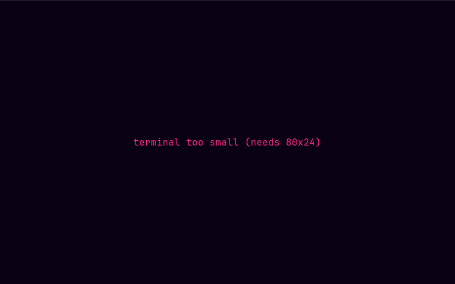

# Troubleshooting

**Start here:**

```sh
loxia-player --doctor
```

It prints the config path and any validation warnings, keybinding conflicts, the libmpv version and
load path, every output device mpv can see, the terminal's graphics protocol and size, cache and
download locations with sizes, and whether your server answers — with tokens and header values
redacted. It exits non-zero if anything failed.

Attach its output to any bug report.

- [Building](#building)
- [libmpv is not found](#libmpv-is-not-found)
- [No sound](#no-sound)
- [Switching output device](#switching-output-device)
- [Connecting to the server](#connecting-to-the-server)
- [The interface](#the-interface)
- [Album art](#album-art)
- [Keys and input](#keys-and-input)
- [Cache and downloads](#cache-and-downloads)
- [Settings that appear not to work](#settings-that-appear-not-to-work)
- [Integrations](#integrations)
- [Logs](#logs)
- [Reporting a bug](#reporting-a-bug)

## Building

**`cannot find -lmpv` / `mpv.lib not found` at link time.**
The libmpv *development* files are missing. Most distributions split them into a separate package —
`libmpv-dev`, `mpv-libs-devel`, `mpv-devel`. See the table in
[Installation](installation.md#installing-mpv). Verify with:

```sh
pkg-config --modversion mpv     # should print 2.x
```

On Windows you need an import library (`mpv.lib` for MSVC, `libmpv.dll.a` for GNU) on the `LIB` path —
see the [Windows notes](installation.md#windows).

**`error: failed to run custom build command for libmpv2-sys`.**
Same cause. `pkg-config` itself may also be missing; install it alongside the mpv development package.

**The toolchain version is wrong.**
Do not install a toolchain by hand. `rust-toolchain.toml` pins 1.97.1 and `rustup` applies it
automatically for any `cargo` command run inside the checkout. If you see an MSRV error, check you
actually have `rustup` rather than a distribution-packaged `cargo`.

## libmpv is not found

At startup loxia exits with:

```text
loxia-player requires libmpv, which was not found.

  install mpv from your distribution's repositories (it provides libmpv) — …

See https://github.com/tuturu742/loxia-player#installing-mpv for details.

Pass --no-audio to browse the library without playback in the meantime.
```

The library built fine but cannot be loaded at runtime. In order of likelihood:

1. **mpv is not installed at all.** Install it — [table here](installation.md#installing-mpv).
2. **It is installed somewhere the dynamic loader does not look** — a Homebrew-on-Linux prefix, a
   manual `/opt` build. The build script adds an rpath from `pkg-config`, so make sure
   `pkg-config --modversion mpv` worked *at build time*, then rebuild. As a stopgap, set
   `LD_LIBRARY_PATH` (Linux) or `DYLD_LIBRARY_PATH` (macOS) to the directory holding the library.
3. **Windows: `mpv-1.dll` is not beside the executable or on `PATH`.** loxia looks next to the `.exe`
   first, so putting it there works without touching `PATH`.
4. **A major-version mismatch.** loxia needs the libmpv 2.0 client API, i.e. mpv 0.35 or newer. A very
   old distribution package may still ship `libmpv.so.1`, which will not load.

`--doctor`'s `Audio → libmpv` line prints the exact path that *was* loaded when it works, which is the
quickest way to confirm you fixed the right thing.

To keep going meanwhile, `--no-audio` starts loxia with a silent mock engine. Everything works except
sound.

## No sound

**Playback looks normal — the position advances, the queue moves — but nothing is audible.**

First check whether loxia fell back to the mock engine. It says so twice: a startup toast reading
"audio playback failed to start: …", and `Settings → About`, whose libmpv line reads
`not loaded (…)`. If either says so, the cause is in the previous section. (If you passed
`--no-audio` yourself, that is exactly what it does and there is no toast.)

If libmpv *is* loaded:

1. **Volume or mute.** Check the player bar's volume readout. `M` toggles mute.
2. **The wrong output device.** `O` opens the picker; the list is grouped by driver.
   `--doctor` prints the same list with the exact ids. A device your config names that no longer exists
   is a common cause after a hardware change — set `audio.device_id` back to `"auto"`. See
   [Switching output device](#switching-output-device) below.
3. **A driver that cannot open the device.** If `audio.output_driver` names something specific
   (`alsa` while PipeWire holds the card exclusively, say), try `"auto"` and let mpv choose.
4. **The equalizer.** An extreme preset can cut a lot. Press `e`, then `t` to turn it off entirely.
5. **ReplayGain plus a negative preamp.** A large negative `audio.replaygain_preamp_db` on top of
   album gain can be very quiet. `r` cycles ReplayGain off.

### Switching output device

**A device change made with `O` while a track is playing does not take effect.** Known limitation in
0.1.0 — enumeration and the picker are fine, but applying the change mid-track is unreliable. Set the
device before playback starts, or pin it in the config and restart:

```toml
[audio]
device_id = "pipewire/alsa_output.pci-0000_00_1f.3.analog-stereo"
```

`loxia-player --doctor` prints every device mpv can see, with the exact id to paste in. Tracked in
[ROADMAP.md](../../ROADMAP.md).

**Playback stutters or stalls.** Raise `audio.buffer_size_ms` (2000 by default); it controls how far
ahead mpv reads. On a slow link, also try `q` to drop to a transcoded profile, which is a fraction of
the bandwidth of direct FLAC.

**Gaps between tracks.** Gapless needs the next track preloaded. Set `cache.prefetch_next` to at least
`1` (the default) so the next entry is fetched while the current one plays.

## Connecting to the server

**"no server configured".** Add one: `Alt+0` → Servers → Add server. See
[Getting started](getting-started.md#connecting-to-a-server).

**Test connection fails.**

| Symptom | Likely cause |
| :-- | :-- |
| Connection refused / no route | Wrong host or port. Emby's defaults are `8096` (HTTP) and `8920` (HTTPS). |
| TLS error | An untrusted certificate. REST requests validate against your **system** trust store, so a private CA installed there is accepted; a self-signed certificate that is not in it is not. Note that the WebSocket connection uses a *bundled* root set and will still reject a private CA — if only remote control fails, that is why. |
| 401 / invalid credentials | Wrong username or password. Emby is case-sensitive about usernames. |
| 403, or an HTML login page | A gateway in front of Emby. Add the headers it needs under **add header** in the same form. |
| Hangs then times out | Something is swallowing the request. Try the LAN address directly to isolate the proxy. |

Do **not** append `/emby` to the URL — loxia adds the API path itself. A sub-path prefix
(`https://host/media`) is fine and is preserved.

**It connected before and now does not.** The access token may have been revoked server-side (a
password change, a device purge in the Emby dashboard). Re-enter your password in the server editor to
mint a new one.

**"that address answers as a different server".** An address in this profile answered as a different
Emby installation — usually stale DNS, or a config copied to another machine. loxia refuses it rather
than attaching this profile's cache and downloads to someone else's library. Fix the address, or remove
the `server_id` line if you genuinely re-pointed the profile at a new server.

**Browsing lists seem to be missing things.** With several music libraries, lists should span all of
them. If one is missing, check that your Emby user actually has access to it.

## The interface

**"terminal too small".** Below 80×24 the layout has nowhere to go, so loxia replaces it with a single
line rather than rendering something broken. Resize the window, or reduce your font size.



**The layout is broken, borders are garbage characters.** Your font lacks the box-drawing glyphs. Set
`ui.ascii_only = true` (Settings → Interface), which swaps every border, bar, spinner and glyph for
ASCII.

**Colours are wrong or unreadable.** `default_terminal` deliberately uses your terminal's own ANSI
palette, so a theme you dislike there is really your terminal's palette. Pick an explicit theme —
`darcula`, `far_blue`, `oled_black` — which sets its own colours. Confirm your terminal advertises true
colour (`COLORTERM=truecolor`).

**Text selection with the mouse no longer works.** loxia captures the mouse. Set
`ui.enable_mouse = false`, or hold your terminal's override modifier (usually `Shift`) while dragging.

**The screen is left in a broken state after a crash.** It should not be — the terminal is restored
even on a panic. If it happens, `reset` in your shell fixes it, and it is worth reporting with the log.

## Album art

**No artwork at all.** Check `--doctor`'s `Terminal → art protocol` line.

- `Halfblocks` means no image protocol was detected. Real images need Kitty, Ghostty, WezTerm, Konsole
  or a Sixel-capable terminal. Halfblocks is the coarse but functional fallback.
- If your terminal *does* support images but was not detected, force it:
  `ui.album_art_protocol = "kitty"` or `"sixel"`.
- `ui.album_art_protocol = "off"` disables artwork entirely — check you have not set that.
- Inside tmux or screen, pass-through often breaks image protocols. Try outside the multiplexer to
  isolate it.

**Artwork is garbled, or leaves debris on the screen.** A protocol mismatch. Force `halfblocks`, which
never does anything a terminal cannot handle.

**A track shows a placeholder.** That item genuinely has no image on the server.

**The inspector shows no artwork but Now Playing does.** `ui.show_inspector_art` is off. It skips the
fetch entirely, by design.

## Keys and input

**A key does nothing.** Run `--doctor` and read `Keybindings → conflicts`. If two actions claim one
chord the later override wins, and the other action silently loses its key. The same information is in
Settings → Keybindings, badged.

**`Alt+1`…`Alt+0` do nothing.** Your terminal or multiplexer is eating `Alt`. `F2`–`F10` alias tabs
2–10. For tab 1, remap: `jump_tab1 = "ctrl+1"` or similar.

**An override in `config.toml` is ignored.** Check the direction — the key is the **action name**, the
value is the chord:

```toml
[keybindings]
seek_back5 = "ctrl+left"    # correct
# "ctrl+left" = "seek_back5"  # wrong way round
```

An unparseable chord or an unrecognised action name is skipped with a startup warning; `--doctor` lists
those under `Keybindings → parsed`.

**A default binding stopped working after I added one.** An override *replaces* that action's defaults
rather than adding to them. See [Keybindings](keybindings.md#remapping).

## Cache and downloads

**Where is everything?** `--doctor`'s `Storage` section prints every path with its current size.

**The cache is bigger than my limit.** The limit applies to the rolling track cache only. Pinned
downloads and the image cache are budgeted separately (`cache.image_cache_mb`). Eviction is triggered
by new writes, so a cache that shrank below its limit after you lowered the setting catches up on the
next few plays.

**`cache_dir` or `download_dir` has no effect.** It must be an **absolute** path. A relative one is
rejected with a startup warning and the platform default is used, rather than scattering caches
wherever you launched from.

**The disk filled up.** Lower `cache.rolling_max_gb`, or unpin downloads with `d`. `--doctor` shows
what each is consuming.

**"the cache lock is held by another loxia-player instance".** Two copies are running. The second
opens the cache read-only, which is safe but means it will not cache new tracks. Quit one.

**Play counts are not going up on the server.** They are reported as a track plays through; skipping
early does not count. Anything played while the `OFFLINE` badge is showing is **not** reported at all —
the buffer that would replay it on reconnect is not wired up in 0.1.0.

**Browsing while offline shows a load failure.** Expected in 0.1.0: fetching a fresh column from your
downloaded library is not yet wired up. Columns already loaded stay usable, and queued downloaded
tracks keep playing. See [ROADMAP.md](../../ROADMAP.md).

## Settings that appear not to work

**A value I wrote in `config.toml` came back changed.** Out-of-range values are clamped and unknown
values fall back to defaults, each with a startup warning. `--doctor`'s `Configuration → warnings` line
lists every one, naming the field. Common cases: an unknown theme name, `rolling_max_gb` at zero,
`prefetch_next` above 10, EQ gains beyond ±12 dB, a log level that is not one of the five plain names.

**My comments and formatting disappeared.** Changing a setting in Settings rewrites the file. The app
owns it; comments and ordering are not preserved.

**`logging.level = "info,loxia_emby=debug"` was reset to `info`.** The config key accepts only a plain
level. Per-module filters work through the environment instead:

```sh
LOXIA_LOG='info,loxia_emby=debug' loxia-player
```

**The config file was replaced and my old one is `config.toml.bad`.** It did not parse, so it was
quarantined and replaced with defaults rather than blocking startup. Fix the TOML and move it back.

**A permissions warning at startup.** The file holds a plaintext access token and is group- or
world-readable. `chmod 600` the path it names.

## Integrations

**Media keys do nothing (Linux).** MPRIS needs a D-Bus session. Check with
`busctl --user list | grep mpris` while loxia is running. Under a bare window manager with no session
D-Bus, there is nothing to register with.

**No desktop notifications.** They are **deliberately suppressed while the terminal has focus** — the
point is to tell you about a track change you cannot see, so switch away from loxia to test. Beyond
that: on Linux they need a notification daemon and libnotify, and check `ui.desktop_notifications` is
on. It fails silently when nothing is listening.

**Remote control from the Emby web UI does nothing.** Needs the WebSocket connection. Check
`ui.enable_websocket` is on, and that any reverse proxy in front of Emby passes WebSocket upgrades —
many do not by default. A private CA is another cause: the WebSocket validates against a bundled root
set rather than your system trust store, so it can fail where REST requests succeed. The log warns once
when the connection fails; browsing and playback continue regardless.

## Logs

Logs go to a file, never to the terminal.

| Platform | Location |
| :-- | :-- |
| Linux, BSD | `~/.local/state/loxia-player/` |
| macOS | `~/Library/Application Support/loxia-player/` |
| Windows | `%APPDATA%\loxia-player\` |

Files are named `loxia-player.log.YYYY-MM-DD` and rotate daily, with `logging.max_files` kept (5 by
default). `--doctor` prints the directory and names the newest file.

For more detail on one run:

```sh
LOXIA_LOG=debug loxia-player
# or scope it to one area
LOXIA_LOG='info,loxia_emby=debug,loxia_audio=debug' loxia-player
```

Access tokens and stream URLs are redacted from every log line, so a log is safe to attach as-is.

## Reporting a bug

Open an issue at <https://github.com/tuturu742/loxia-player/issues> with:

1. **`loxia-player --doctor` output.** Already redacted.
2. **What you did, what happened, what you expected.**
3. **Your terminal emulator and version** — a great many rendering issues are terminal-specific.
4. **The relevant log lines**, from the paths above. `LOXIA_LOG=debug` for a reproduction run helps.
5. **A screenshot**, for anything about layout. Worth far more than a description.
